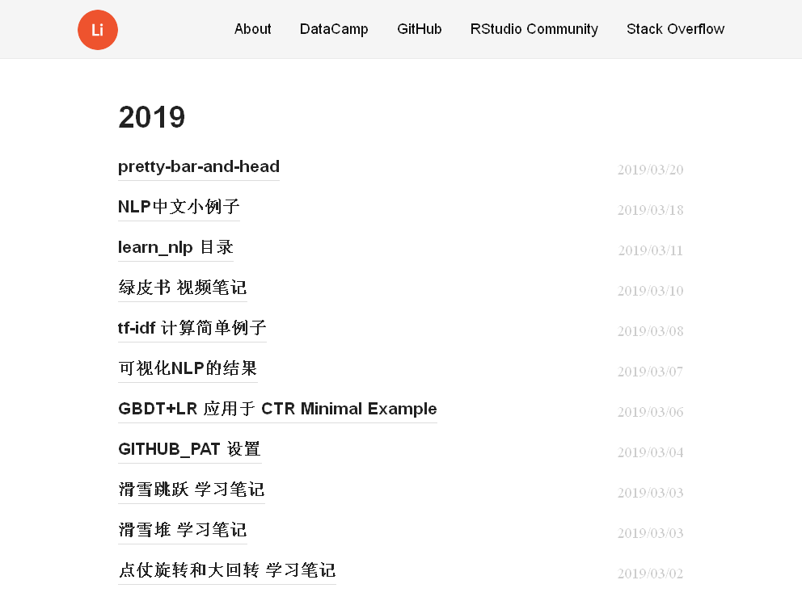
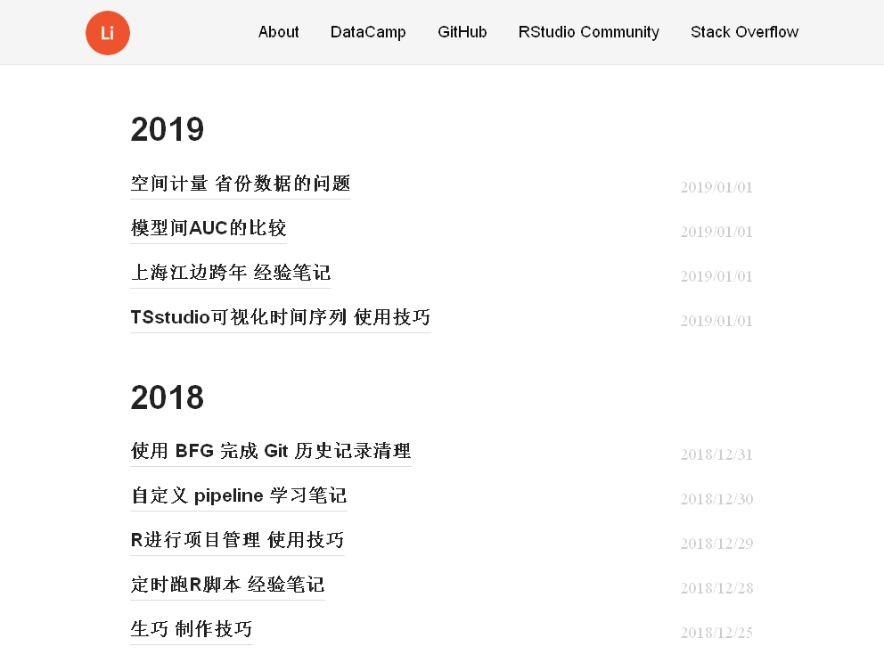

webshot 包 使用技巧
================

参考[wch](https://wch.github.io/webshot/articles/intro.html)

``` r
webshot::install_phantomjs()
```

需要外部的 PhantomJS 程序支持。

``` r
library(webshot)
```

    ## Warning: package 'webshot' was built under R version 3.5.2

``` r
url <- "https://jiaxiangli.netlify.com/"
webshot(
    url = url
    ,delay = 0.5
    ,file = 'save_blog_site_screenshot.png'
    ,cliprect = "viewport"
    )
```

<!-- -->

``` r

```

<!-- -->

1.  `,cliprect = "viewport"`不全页截屏
2.  `,delay = 0.5` deplay 0.5s等加载完全

<!-- end list -->

``` r
webshot(url
        ,file = 'save_blog_site_screenshot_subset.png'
        ,cliprect = c(200, 5, 400, 300))
```

<!-- -->

``` r

```

<!-- -->

``` r
webshot(url
        ,file = 'save_blog_site_screenshot_css.png'
        ,selector = ".nav-links")
```

<!-- -->

``` r

```

<!-- -->

<input type="checkbox" id="checkbox1" class="styled">修改函数，不需要save，直接
preview

``` r
webshot(url
        ,file = 'save_blog_site_screenshot_title.png'
        ,selector = c("h2"))
```

<!-- -->

``` r
knitr::include_graphics('save_blog_site_screenshot_title.png')
```

<!-- -->

这个应该是英文标题才行。
